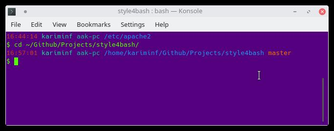

# style for bash

If you want to give your bash terminal some style, here some little bash programs to do so.

## How to?
just copy the program of your favorite style into your **~/.bashrc** file.

## Styles

### Durrant
This style is proposed by [Michael Durrant](https://unix.stackexchange.com/a/178817) on [unix.stackexchange.com](https://unix.stackexchange.com/questions/148/colorizing-your-terminal-and-shell-environment). Therefore, its license is CC-BY-SA-3.0 and not MIT.

Features:
- shows git branch!
- long directory paths (more than 6 elements) are 'trimmed' to show top 3 and bottom 3 directories with _ between then (that's the pwd sed part of LOCATION).
- carriage return at the end so that prompt is always on the left!

[open it](./durrant)

